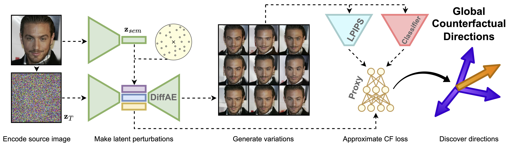

# [ECCV 2024] Global Counterfactual Directions

Official implementation of [Global Counterfactual Directions](https://arxiv.org/abs/2404.12488) accepted to ECCV 2024.



## Virtual environment

We provide `requirements.txt` file generated with `pip` to create a virtual environment with all required packages.

## Required files

To run the experiments, it is required to download:
- DiffAE weights
- Classifier weights
- Dataset

We provide weights through the [attached link](https://drive.google.com/drive/folders/1-HraJKbEI8wNIKWh5YS3RzVyAYmP9-Yd?usp=share_link). We do not include the FFHQ DiffAE checkpoint as it can be obtained through the original paper's [repository](https://github.com/phizaz/diffae). For datasets, we refer to the following sources:
- [CelebA](https://mmlab.ie.cuhk.edu.hk/projects/CelebA.html)
- [CelebA-HQ](https://github.com/switchablenorms/CelebAMask-HQ)
- [CheXpert](https://stanfordmlgroup.github.io/competitions/chexpert/)

Our codebase assumes that images are placed as `.png` files, with each file in a separate folder.

We also include example gradient-based directions used in computing the results included in the paper.

To run proxy training and/or direction transfer, move to `gcd`. To create attribution maps, move to `bblig`.

## Proxy training

We include Hydra configuration files that allow for running the proxy training loop (see `configs` directory). Each field with `???` is required and must be filled by the user for the code to work correctly. To run the experiment, use

```
python src/main.py --config-path ../configs/single_image_gmc_mlp_proxy_training/DATASET/MODEL/CLASS
```

where `DATASET`, `MODEL` and `CLASS` are specified by the subdirectories in the `configs` directory.

## Direction transfer

Proxy training phase automatically creates a log subdirectory in the `outputs` directory. To perform direction transfer on a different image, move to `gcd` directory (aka `cd gcd`) and use

```
python src/direction_transfer.py --log-dir-path LOG_DIR_PATH --direction-path DIRECTION_PATH --img-path IMG_PATH --subdir-name SUBDIR_NAME
```

where `LOG_DIR_PATH` is a path to a log directory created as a subdirectory of `outputs`. Directions found throughout proxy training phase can be found in the `proxy` subdirectory of the log directory, and `DIRECTION_PATH` should point to a `.pt` file with such direction. The `IMG_PATH` argument is a path to `.png` file with the image on which you want to perform direction transfer. The `SUBDIR_NAME` argument gives a name to a subdirectory where the results of the transfer are stored (inside the `direction_transfer` subdirectory of the log directory).

## BB-LIG

To produce attribution maps with BB-LIG, use

```
python src/main.py --config-name sig
```

You may also customize the configs by following Hydra documentation.

## Citation

```
@InProceedings{sobieski2024global,
author="Sobieski, Bartlomiej and Biecek, Przemyslaw",
title="Global Counterfactual Directions",
booktitle="European Conference on Computer Vision",
year="2024",
publisher="Springer Nature Switzerland",
}
```